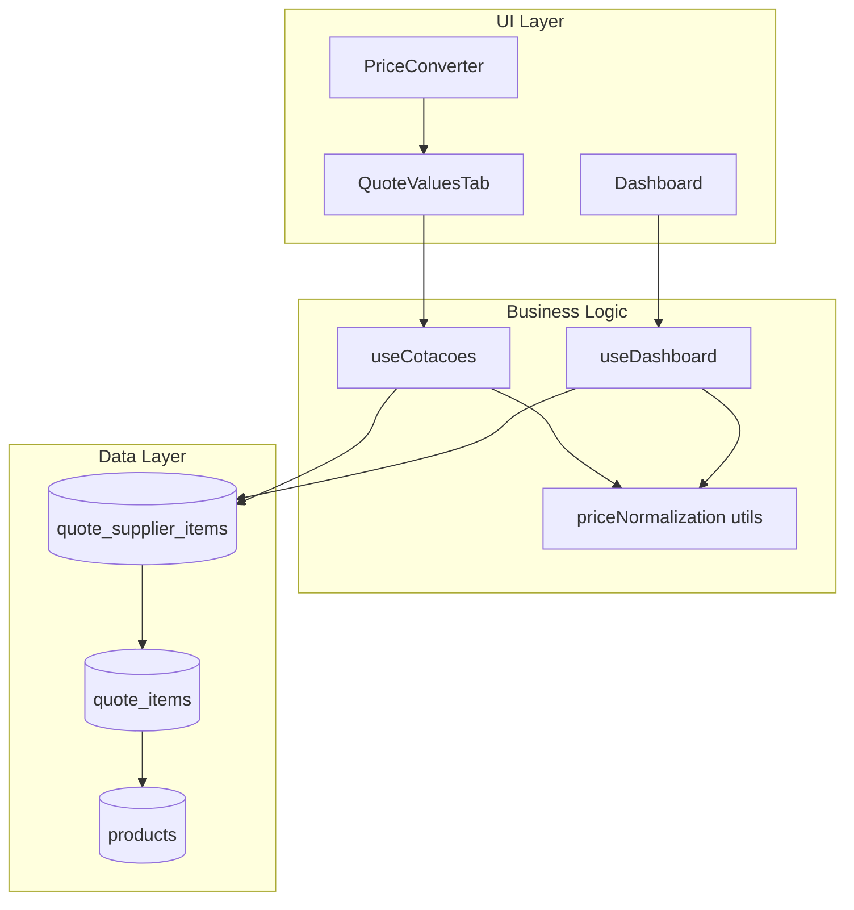

# Design Document: Sistema de Unidade de Precificação

## Overview

Este documento descreve o design técnico para implementar o sistema de unidade de precificação nas cotações. A solução permite que usuários especifiquem em qual unidade o preço foi informado (kg, unidade, caixa, pacote) e calcula a economia real considerando as quantidades totais de compra.

A implementação envolve:
1. Alterações no banco de dados para armazenar metadados de precificação
2. Funções de normalização de preços para comparação correta
3. Atualização da UI de edição de preços
4. Correção do cálculo de economia no dashboard

## Architecture



## Components and Interfaces

### 1. Price Normalization Utility

```typescript
// src/utils/priceNormalization.ts

export type PricingUnit = 'kg' | 'un' | 'cx' | 'pct';

export interface PriceMetadata {
  valorOferecido: number;      // Valor informado pelo fornecedor
  unidadePreco: PricingUnit;   // Unidade do preço informado
  fatorConversao?: number;     // Fator de conversão (ex: 12 un/cx)
  quantidadePorEmbalagem?: number; // Quantidade por embalagem
}

export interface NormalizedPrice {
  valorUnitario: number;       // Preço por unidade base (kg ou un)
  valorTotal: number;          // Preço total para a quantidade de compra
  unidadeBase: 'kg' | 'un';    // Unidade base normalizada
}

// Normaliza preço para unidade base
export function normalizePrice(
  price: PriceMetadata,
  purchaseQuantity: number,
  purchaseUnit: string
): NormalizedPrice;

// Calcula economia entre fornecedores
export function calculateEconomy(
  supplierPrices: PriceMetadata[],
  purchaseQuantity: number,
  purchaseUnit: string
): { economiaReal: number; melhorPreco: number; piorPreco: number };
```

### 2. Updated QuoteValuesTab Props

```typescript
interface PriceEditState {
  productId: string;
  valor: number;
  unidadePreco: PricingUnit;
  fatorConversao?: number;
  quantidadePorEmbalagem?: number;
}
```

### 3. Database Schema Changes

New columns in `quote_supplier_items`:
- `unidade_preco`: varchar(10) - Pricing unit (kg, un, cx, pct)
- `fator_conversao`: decimal(10,4) - Conversion factor
- `quantidade_por_embalagem`: decimal(10,4) - Quantity per package

## Data Models

### QuoteSupplierItem (Extended)

```typescript
interface QuoteSupplierItem {
  id: string;
  quote_id: string;
  supplier_id: string;
  product_id: string;
  product_name: string;
  valor_oferecido: number;
  // New fields
  unidade_preco: PricingUnit;
  fator_conversao: number | null;
  quantidade_por_embalagem: number | null;
  created_at: string;
  updated_at: string;
}
```

### Economy Calculation Result

```typescript
interface ProductEconomy {
  productId: string;
  productName: string;
  purchaseQuantity: number;
  purchaseUnit: string;
  bestPrice: {
    supplierId: string;
    supplierName: string;
    valorUnitario: number;
    valorTotal: number;
  };
  worstPrice: {
    supplierId: string;
    supplierName: string;
    valorUnitario: number;
    valorTotal: number;
  };
  economiaReal: number; // In R$
}

interface QuoteEconomySummary {
  quoteId: string;
  products: ProductEconomy[];
  economiaTotal: number;
  fornecedoresParticipantes: number;
}
```

## Correctness Properties

*A property is a characteristic or behavior that should hold true across all valid executions of a system-essentially, a formal statement about what the system should do. Properties serve as the bridge between human-readable specifications and machine-verifiable correctness guarantees.*

### Property 1: Price Normalization Consistency
*For any* price with metadata (value, pricing unit, conversion factor), normalizing to base unit and then calculating total should equal: `valor × quantidade / fator_conversao` when pricing unit differs from purchase unit.
**Validates: Requirements 2.1**

### Property 2: Economy Calculation Formula
*For any* set of normalized supplier prices for a product, the economy should equal `(max_price - min_price) × purchase_quantity`, and this value should always be >= 0.
**Validates: Requirements 2.2**

### Property 3: Total Economy Aggregation
*For any* quote with multiple products, the total economy should equal the sum of individual product economies.
**Validates: Requirements 2.4**

### Property 4: Conversion Factor Requirement
*For any* price entry where pricing unit is 'cx' or 'pct', the conversion factor field should be required and must be > 0.
**Validates: Requirements 1.5**

### Property 5: Price Display Format
*For any* saved price with unit metadata, the displayed string should contain both the value and the unit label in format "R$ X.XX/unit".
**Validates: Requirements 1.4**

### Property 6: Best Price Determination
*For any* set of supplier prices for a product, the best price should be determined by comparing normalized unit values, not original values.
**Validates: Requirements 3.3**

### Property 7: Default Pricing Unit
*For any* new quote_supplier_item created without explicit pricing unit, the pricing unit should default to the product's base unit from the products table.
**Validates: Requirements 5.5**

### Property 8: PriceConverter Integration
*For any* price calculated via PriceConverter, after applying, the pricing unit should be automatically set to the target conversion unit and the conversion factor should be stored.
**Validates: Requirements 4.1, 4.2**

### Property 9: Comparison Display Normalization
*For any* supplier price displayed in comparison view, if the original unit differs from base unit, both original and normalized values should be shown.
**Validates: Requirements 3.2**

### Property 10: Product Economy Display Completeness
*For any* product economy display, it should contain: product name, best price value, worst price value, and savings amount in R$.
**Validates: Requirements 6.2**

## Error Handling

1. **Invalid Conversion Factor**: If conversion factor is 0 or negative, display error and prevent save
2. **Missing Required Fields**: If pricing unit is cx/pct but conversion factor is missing, show validation error
3. **Database Migration Failure**: Log error and maintain backward compatibility with null values
4. **Calculation Overflow**: Use safe math operations to prevent overflow in large quantity calculations

## Testing Strategy

### Unit Tests
- Test `normalizePrice` function with various unit combinations
- Test `calculateEconomy` function with edge cases (single supplier, same prices)
- Test default value assignment for new records
- Test validation rules for conversion factor

### Property-Based Tests
- Use fast-check library for TypeScript property-based testing
- Configure minimum 100 iterations per property test
- Each property test must reference the corresponding correctness property from this design document
- Format: `**Feature: cotacao-unidade-preco, Property {number}: {property_text}**`

### Integration Tests
- Test full flow: edit price → save → reload → verify metadata persisted
- Test dashboard economy calculation with real database data
- Test PriceConverter integration with price saving
