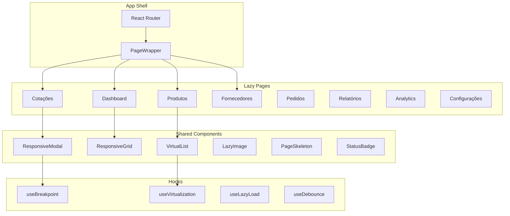

# Design Document: Mobile Performance Refactor

## Overview

Este documento descreve a arquitetura e design para a refatoração completa de performance mobile do aplicativo de cotações. O objetivo é criar uma experiência mobile impecável através de:

1. **Responsividade via CSS/Tailwind** - Eliminar detecção de breakpoints via JavaScript onde possível
2. **Lazy Loading** - Carregar componentes e dados sob demanda
3. **Virtualização** - Renderizar apenas itens visíveis em listas longas
4. **Animações Otimizadas** - Usar apenas transform/opacity para 60fps
5. **Componentes Reutilizáveis** - Padronizar modais, loading states, cards

## Architecture



## Components and Interfaces

### 1. PageSkeleton Component

Componente de skeleton reutilizável que replica a estrutura de cada página durante carregamento.

```typescript
interface PageSkeletonProps {
  variant: 'dashboard' | 'list' | 'grid' | 'form';
  sections?: number;
  itemsPerSection?: number;
}
```

### 2. VirtualList Component

Wrapper para virtualização de listas longas usando react-window.

```typescript
interface VirtualListProps<T> {
  items: T[];
  itemHeight: number | ((index: number) => number);
  renderItem: (item: T, index: number) => React.ReactNode;
  threshold?: number; // Mínimo de itens para ativar virtualização (default: 20)
  overscan?: number; // Itens extras renderizados fora da viewport
}
```

### 3. LazyImage Component (Aprimorado)

Componente de imagem com lazy loading, blur placeholder e fallback.

```typescript
interface LazyImageProps {
  src: string;
  alt: string;
  fallback?: React.ReactNode;
  blurDataURL?: string;
  aspectRatio?: number;
  className?: string;
}
```

### 4. ResponsiveCard Component

Card otimizado para touch com áreas de toque adequadas.

```typescript
interface ResponsiveCardProps {
  children: React.ReactNode;
  onClick?: () => void;
  expandable?: boolean;
  initialExpanded?: boolean;
  touchOptimized?: boolean; // Adiciona padding extra para touch targets
}
```

### 5. MobileFilters Component

Filtros em bottom sheet para mobile.

```typescript
interface MobileFiltersProps {
  filters: FilterConfig[];
  values: Record<string, any>;
  onChange: (key: string, value: any) => void;
  onApply: () => void;
  onReset: () => void;
}
```

### 6. InfiniteScroll Component

Componente para carregamento infinito de dados.

```typescript
interface InfiniteScrollProps {
  hasMore: boolean;
  loadMore: () => void;
  loader?: React.ReactNode;
  threshold?: number; // Pixels antes do fim para disparar loadMore
  children: React.ReactNode;
}
```

## Data Models

### Loading State Model

```typescript
interface LoadingState {
  isLoading: boolean;
  isRefreshing: boolean;
  error: Error | null;
  retryCount: number;
}

interface SectionLoadingState {
  [sectionId: string]: LoadingState;
}
```

### Pagination Model

```typescript
interface PaginationState {
  page: number;
  pageSize: number;
  total: number;
  hasMore: boolean;
}

interface InfiniteQueryState<T> {
  pages: T[][];
  pageParams: number[];
  hasNextPage: boolean;
  isFetchingNextPage: boolean;
}
```

### Animation Config Model

```typescript
interface AnimationConfig {
  duration: number; // ms
  easing: string;
  enableHover: boolean;
  enableTransitions: boolean;
  respectReducedMotion: boolean;
}
```

## Correctness Properties

*A property is a characteristic or behavior that should hold true across all valid executions of a system-essentially, a formal statement about what the system should do. Properties serve as the bridge between human-readable specifications and machine-verifiable correctness guarantees.*

### Property 1: CSS Grid Layout Without JavaScript
*For any* ResponsiveGrid component with a given config, the rendered output SHALL use only CSS classes for responsive layout without runtime JavaScript breakpoint detection for column changes.
**Validates: Requirements 1.2**

### Property 2: Loading State Consistency
*For any* page component, when isLoading is true, the component SHALL render skeleton placeholders that match the structure of the loaded content.
**Validates: Requirements 1.5, 5.1, 10.1, 10.2**

### Property 3: Virtualization Threshold
*For any* list with more than the configured threshold items (default 20), the VirtualList component SHALL render only visible items plus overscan buffer.
**Validates: Requirements 2.1, 4.5, 13.5, 15.5**

### Property 4: Touch Target Minimum Size
*For any* interactive button or touchable element, the computed touch target area SHALL be at least 44x44 pixels.
**Validates: Requirements 2.5, 18.1**

### Property 5: Mobile Card Layout
*For any* list page rendered on mobile viewport (width < 768px), the layout SHALL display items in card format rather than table rows.
**Validates: Requirements 3.1**

### Property 6: Modal Pattern by Viewport
*For any* ResponsiveModal component, when rendered on mobile (width < 768px) it SHALL use Drawer (bottom sheet), and when rendered on desktop (width >= 768px) it SHALL use Dialog (centered modal).
**Validates: Requirements 3.5, 5.5, 9.1, 9.2**

### Property 7: StatusBadge Consistency
*For any* status display across all pages, the StatusBadge component SHALL be used with consistent styling for the same status values.
**Validates: Requirements 3.4, 5.4**

### Property 8: Animation Duration Limits
*For any* transition animation, the duration SHALL not exceed 300ms, and hover transitions SHALL not exceed 150ms.
**Validates: Requirements 3.2, 7.5, 9.3, 11.5**

### Property 9: Lazy Loading for Pages
*For any* page component in the router, it SHALL be wrapped in React.lazy() for code splitting.
**Validates: Requirements 12.2**

### Property 10: Lazy Loading for Dialogs
*For any* dialog component that is not immediately visible, it SHALL be loaded only on first user interaction.
**Validates: Requirements 12.3**

### Property 11: Transform-Only Animations
*For any* animation applied to elements, only CSS transform and opacity properties SHALL be animated to ensure GPU acceleration.
**Validates: Requirements 11.1, 11.4**

### Property 12: Reduced Motion Respect
*For any* animated element, when the user has prefers-reduced-motion enabled, non-essential animations SHALL be disabled.
**Validates: Requirements 11.2**

### Property 13: Image Lazy Loading
*For any* image displayed in the application, it SHALL use lazy loading with a placeholder until the image is loaded.
**Validates: Requirements 2.4, 17.1**

### Property 14: Debounced Search Input
*For any* search input field, the search query SHALL be debounced by at least 300ms before triggering data fetching.
**Validates: Requirements 2.3**

### Property 15: Pagination Batch Size
*For any* paginated data fetch, the batch size SHALL be configurable with a default of 10 items per page.
**Validates: Requirements 3.3**

### Property 16: Error State with Retry
*For any* data fetching error, the UI SHALL display an error state with a retry action button.
**Validates: Requirements 10.5**

### Property 17: Form Submit Loading State
*For any* form submission, the submit button SHALL be disabled and show loading indicator during the async operation.
**Validates: Requirements 16.4**

### Property 18: Mobile Typography Minimum
*For any* body text rendered on mobile, the font size SHALL be at least 16px (1rem).
**Validates: Requirements 18.3**

### Property 19: Collapsible Sections on Mobile
*For any* settings or configuration page on mobile, sections SHALL be displayed in collapsible accordion format.
**Validates: Requirements 8.1**

### Property 20: Filter State Persistence
*For any* filter applied on a list page, the filter state SHALL be maintained when navigating away and returning to the page.
**Validates: Requirements 4.4, 14.4**

## Error Handling

### Network Errors
- Display toast notification with error message
- Show inline error state with retry button
- Cache last successful data for offline viewing

### Loading Timeouts
- Show loading indicator after 200ms delay
- Display timeout message after 10 seconds
- Offer retry option

### Component Errors
- Use ErrorBoundary to catch render errors
- Display fallback UI with error details
- Log errors to monitoring service

## Testing Strategy

### Unit Testing Framework
- **Vitest** for unit tests
- **React Testing Library** for component tests
- **fast-check** for property-based testing

### Property-Based Testing Approach

Each correctness property will be implemented as a property-based test using fast-check. Tests will:

1. Generate random valid inputs (viewport sizes, item counts, configs)
2. Render components with generated inputs
3. Assert that properties hold for all generated cases
4. Run minimum 100 iterations per property

### Test Categories

1. **Layout Properties** (1, 5, 19)
   - Test CSS class generation for different viewport sizes
   - Verify grid column counts match config

2. **Loading State Properties** (2, 16, 17)
   - Test skeleton rendering during loading
   - Verify error states include retry actions

3. **Virtualization Properties** (3)
   - Test item count thresholds
   - Verify only visible items are rendered

4. **Touch/Accessibility Properties** (4, 18)
   - Test computed dimensions of interactive elements
   - Verify font sizes meet minimums

5. **Modal Properties** (6)
   - Test component type based on viewport
   - Verify Drawer vs Dialog rendering

6. **Animation Properties** (8, 11, 12)
   - Test duration values in CSS
   - Verify transform-only animations
   - Test reduced motion handling

7. **Lazy Loading Properties** (9, 10, 13)
   - Test React.lazy usage
   - Verify image loading behavior

8. **Data Handling Properties** (7, 14, 15, 20)
   - Test debounce timing
   - Verify pagination configuration
   - Test filter persistence

### Test File Structure

```
src/
├── components/
│   └── responsive/
│       └── __tests__/
│           ├── ResponsiveGrid.property.test.ts
│           ├── ResponsiveModal.property.test.ts
│           ├── VirtualList.property.test.ts
│           └── TouchTargets.property.test.ts
├── hooks/
│   └── __tests__/
│       └── useBreakpoint.property.test.ts
└── pages/
    └── __tests__/
        ├── Dashboard.property.test.ts
        └── PageLazyLoading.property.test.ts
```

### Test Annotations

Each property-based test must include:
```typescript
/**
 * **Feature: mobile-performance-refactor, Property N: Property Name**
 * **Validates: Requirements X.Y**
 */
```
