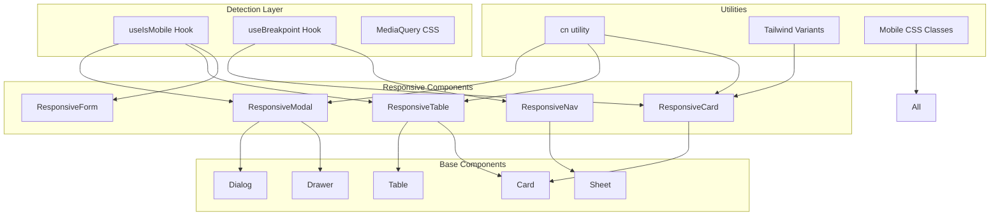

# Design Document: Mobile Responsiveness

## Overview

Este documento descreve a arquitetura e design para melhorar a responsividade do sistema em dispositivos móveis e tablets. A solução foca em criar componentes reutilizáveis que se adaptam automaticamente ao contexto do dispositivo, evitando código duplicado e mantendo performance otimizada.

A abordagem principal é "mobile-first" com progressive enhancement para desktop, utilizando o sistema de breakpoints do Tailwind CSS e o hook `useIsMobile` existente para detecção de dispositivos.

## Architecture



## Components and Interfaces

### 1. ResponsiveModal Component

```typescript
interface ResponsiveModalProps {
  open: boolean;
  onOpenChange: (open: boolean) => void;
  title: string;
  description?: string;
  children: React.ReactNode;
  // Configurações específicas
  mobileFullHeight?: boolean;
  desktopMaxWidth?: 'sm' | 'md' | 'lg' | 'xl';
  showDragIndicator?: boolean;
}

// Renderiza Drawer em mobile, Dialog em desktop
export function ResponsiveModal(props: ResponsiveModalProps): JSX.Element;
```

### 2. ResponsiveTable Component

```typescript
interface Column<T> {
  key: keyof T;
  header: string;
  priority: 'high' | 'medium' | 'low'; // Controla visibilidade em breakpoints
  render?: (value: T[keyof T], row: T) => React.ReactNode;
  mobileLabel?: string; // Label para formato card
}

interface ResponsiveTableProps<T> {
  data: T[];
  columns: Column<T>[];
  onRowAction?: (action: string, row: T) => void;
  actions?: Array<{
    key: string;
    label: string;
    icon: React.ComponentType;
    variant?: 'default' | 'destructive';
  }>;
  emptyState?: React.ReactNode;
  isLoading?: boolean;
}

export function ResponsiveTable<T>(props: ResponsiveTableProps<T>): JSX.Element;
```

### 3. ResponsiveCard Component

```typescript
interface ResponsiveCardProps {
  children: React.ReactNode;
  className?: string;
  // Variantes de tamanho responsivo
  size?: 'compact' | 'default' | 'large';
  // Padding responsivo automático
  padding?: 'none' | 'sm' | 'md' | 'lg';
}

export function ResponsiveCard(props: ResponsiveCardProps): JSX.Element;
```

### 4. useBreakpoint Hook

```typescript
type Breakpoint = 'mobile' | 'tablet' | 'desktop';

interface BreakpointState {
  current: Breakpoint;
  isMobile: boolean;
  isTablet: boolean;
  isDesktop: boolean;
  width: number;
}

export function useBreakpoint(): BreakpointState;
```

### 5. Mobile-Optimized CSS Classes

```css
/* Utilitários para touch targets */
.touch-target { min-height: 44px; min-width: 44px; }

/* Padding responsivo */
.p-responsive { @apply p-3 sm:p-4 lg:p-6; }

/* Gap responsivo */
.gap-responsive { @apply gap-2 sm:gap-4 lg:gap-6; }

/* Texto responsivo */
.text-responsive { @apply text-sm sm:text-base; }
.heading-responsive { @apply text-lg sm:text-xl lg:text-2xl; }
```

## Data Models

### Breakpoint Configuration

```typescript
const BREAKPOINTS = {
  mobile: 0,
  tablet: 768,
  desktop: 1024,
} as const;

const MOBILE_BREAKPOINT = 768; // Mantém compatibilidade com useIsMobile existente
```

### Responsive Spacing Scale

```typescript
const SPACING = {
  mobile: {
    page: { x: 16, y: 12 },
    section: 16,
    card: 12,
    input: 44, // Touch target height
  },
  tablet: {
    page: { x: 24, y: 16 },
    section: 20,
    card: 16,
    input: 40,
  },
  desktop: {
    page: { x: 32, y: 24 },
    section: 24,
    card: 24,
    input: 40,
  },
} as const;
```

### Animation Configuration

```typescript
const ANIMATIONS = {
  mobile: {
    duration: 150, // Animações mais curtas
    enableHover: false,
    enableComplexTransitions: false,
  },
  desktop: {
    duration: 200,
    enableHover: true,
    enableComplexTransitions: true,
  },
} as const;
```


## Correctness Properties

*A property is a characteristic or behavior that should hold true across all valid executions of a system-essentially, a formal statement about what the system should do. Properties serve as the bridge between human-readable specifications and machine-verifiable correctness guarantees.*

Based on the prework analysis, the following correctness properties have been identified. Properties were consolidated to eliminate redundancy while maintaining comprehensive coverage.

### Property 1: Modal rendering matches device type

*For any* screen width value, the ResponsiveModal component SHALL render as Drawer when width < 768px and as Dialog when width >= 768px.

**Validates: Requirements 1.1, 1.2**

### Property 2: Modal height constraint in mobile

*For any* ResponsiveModal rendered in mobile context (width < 768px), the maximum height SHALL NOT exceed 85vh.

**Validates: Requirements 1.3**

### Property 3: Table transforms to cards in mobile

*For any* ResponsiveTable with data rows rendered in mobile context (width < 768px), the output SHALL contain card elements instead of table rows.

**Validates: Requirements 2.1**

### Property 4: Column visibility respects priority

*For any* ResponsiveTable with columns of varying priorities, columns with priority 'low' SHALL be hidden in tablet (768px <= width < 1024px), and all columns SHALL be visible in desktop (width >= 1024px).

**Validates: Requirements 2.2, 2.3**

### Property 5: Grid columns match breakpoint

*For any* grid container with responsive configuration, the number of columns SHALL be 2 in mobile (width < 768px), 2-3 in tablet (768px <= width < 1024px), and 4 in desktop (width >= 1024px).

**Validates: Requirements 3.2, 3.3, 3.4**

### Property 6: Touch targets meet minimum size

*For any* interactive element (button, input, link) rendered in mobile context, the computed min-height and min-width SHALL be at least 44px.

**Validates: Requirements 4.2, 7.1**

### Property 7: Animations disabled in mobile

*For any* component with animation configuration rendered in mobile context, hover effects and transitions longer than 150ms SHALL be disabled.

**Validates: Requirements 6.1**

### Property 8: Font sizes respect mobile scale

*For any* text element rendered in mobile context, body text SHALL have minimum font-size of 14px, headings SHALL be scaled down by 20% from desktop, and labels SHALL have minimum font-size of 12px.

**Validates: Requirements 8.1, 8.2, 8.3**

### Property 9: Spacing respects mobile scale

*For any* layout container rendered in mobile context, horizontal padding SHALL be 16px and section gaps SHALL be 16px.

**Validates: Requirements 9.1, 9.2**

## Error Handling

### Breakpoint Detection Failures

- Se `window` não estiver disponível (SSR), assumir desktop como fallback
- Se `matchMedia` não for suportado, usar fallback baseado em `innerWidth`
- Cache de valores para evitar recálculos desnecessários

### Component Rendering Errors

- ResponsiveModal: Se detecção falhar, renderizar Dialog como fallback seguro
- ResponsiveTable: Se transformação para cards falhar, manter tabela com scroll horizontal
- Usar Error Boundaries para capturar erros de renderização

### Performance Safeguards

- Debounce em resize listeners (já implementado em useIsMobile)
- Lazy loading de componentes pesados
- Fallback para componentes simplificados se performance degradar

## Testing Strategy

### Dual Testing Approach

Esta feature requer tanto testes unitários quanto testes baseados em propriedades:

1. **Unit Tests**: Verificam comportamentos específicos e edge cases
2. **Property-Based Tests**: Verificam que propriedades universais são mantidas para qualquer input válido

### Property-Based Testing Framework

- **Framework**: fast-check (já instalado no projeto)
- **Configuração**: Mínimo de 100 iterações por propriedade
- **Formato de anotação**: `**Feature: mobile-responsiveness, Property {number}: {property_text}**`

### Test Categories

#### 1. Breakpoint Detection Tests
- Testar `useBreakpoint` com diferentes valores de largura
- Verificar transições entre breakpoints
- Testar comportamento em SSR (window undefined)

#### 2. Component Rendering Tests
- ResponsiveModal: Verificar tipo de componente renderizado por breakpoint
- ResponsiveTable: Verificar transformação table -> cards
- ResponsiveCard: Verificar classes de grid aplicadas

#### 3. Style Application Tests
- Verificar classes CSS aplicadas por breakpoint
- Testar touch target sizes
- Verificar font sizes e spacing

#### 4. Integration Tests
- Testar componentes em contexto de página real
- Verificar que mudanças de breakpoint atualizam UI corretamente

### Property Test Implementation Pattern

```typescript
import * as fc from 'fast-check';

// Gerador de larguras de tela
const screenWidthArb = fc.integer({ min: 320, max: 1920 });

// Gerador de breakpoints
const breakpointArb = fc.constantFrom('mobile', 'tablet', 'desktop');

// Exemplo de teste de propriedade
describe('ResponsiveModal', () => {
  it('**Feature: mobile-responsiveness, Property 1: Modal rendering matches device type**', () => {
    fc.assert(
      fc.property(screenWidthArb, (width) => {
        const isMobile = width < 768;
        const componentType = getRenderedComponentType(width);
        
        if (isMobile) {
          return componentType === 'Drawer';
        } else {
          return componentType === 'Dialog';
        }
      }),
      { numRuns: 100 }
    );
  });
});
```

### Test File Structure

```
src/
├── components/
│   └── responsive/
│       ├── ResponsiveModal.tsx
│       ├── ResponsiveTable.tsx
│       ├── ResponsiveCard.tsx
│       └── __tests__/
│           ├── ResponsiveModal.test.tsx
│           ├── ResponsiveModal.property.test.ts
│           ├── ResponsiveTable.test.tsx
│           ├── ResponsiveTable.property.test.ts
│           └── breakpoint.property.test.ts
└── hooks/
    ├── useBreakpoint.ts
    └── __tests__/
        └── useBreakpoint.property.test.ts
```
