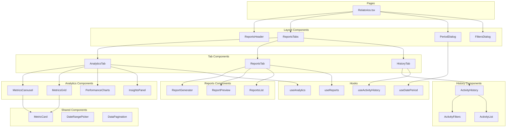

# Design Document

## Overview

Este documento descreve o design técnico para a refatoração da página de Relatórios. O objetivo é melhorar a manutenibilidade do código, aplicar boas práticas de desenvolvimento React/TypeScript, redesenhar o layout para uma melhor UX e otimizar a performance.

A refatoração seguirá os princípios de:
- **Separação de responsabilidades**: Componentes focados em uma única tarefa
- **Composição**: Componentes pequenos e reutilizáveis
- **Performance**: Lazy loading, memoização e virtualização
- **Type Safety**: Tipagem forte com TypeScript

## Architecture



## Components and Interfaces

### Page Component

```typescript
// src/pages/Relatorios.tsx
interface RelatoriosPageProps {}

// Componente principal simplificado que orquestra as tabs
export default function Relatorios(): JSX.Element
```

### Layout Components

```typescript
// src/components/reports/layout/ReportsHeader.tsx
interface ReportsHeaderProps {
  dateRangeText: string;
  onOpenPeriodDialog: () => void;
  onRefresh: () => void;
  onExportAll: () => void;
  isRefreshing: boolean;
  isExporting: boolean;
}

// src/components/reports/layout/ReportsTabs.tsx
interface ReportsTabsProps {
  activeTab: string;
  onTabChange: (tab: string) => void;
  children: React.ReactNode;
}

// src/components/reports/layout/PeriodDialog.tsx
interface PeriodDialogProps {
  isOpen: boolean;
  onOpenChange: (open: boolean) => void;
  startDate: Date | undefined;
  endDate: Date | undefined;
  onStartDateChange: (date: Date | undefined) => void;
  onEndDateChange: (date: Date | undefined) => void;
  onApplyPreset: (days: number) => void;
}

// src/components/reports/layout/FiltersDialog.tsx
interface FiltersDialogProps {
  isOpen: boolean;
  onOpenChange: (open: boolean) => void;
  selectedFornecedores: string[];
  selectedProdutos: string[];
  onFornecedoresChange: (fornecedores: string[]) => void;
  onProdutosChange: (produtos: string[]) => void;
  onReset: () => void;
}
```

### Tab Components

```typescript
// src/components/reports/tabs/AnalyticsTab.tsx
interface AnalyticsTabProps {
  startDate: Date | undefined;
  endDate: Date | undefined;
  selectedFornecedores: string[];
  selectedProdutos: string[];
}

// src/components/reports/tabs/ReportsTab.tsx
interface ReportsTabProps {
  startDate: Date | undefined;
  endDate: Date | undefined;
  onOpenPeriodDialog: () => void;
}

// src/components/reports/tabs/HistoryTab.tsx
interface HistoryTabProps {
  isActive: boolean;
}
```

### Analytics Components

```typescript
// src/components/reports/analytics/MetricsGrid.tsx
interface MetricsGridProps {
  metrics: Metric[];
  isLoading: boolean;
}

// src/components/reports/analytics/MetricsCarousel.tsx
interface MetricsCarouselProps {
  metrics: Metric[];
  isLoading: boolean;
}

interface Metric {
  id: string;
  titulo: string;
  valor: string;
  descricao: string;
  variacao?: string;
  tipo: 'positivo' | 'negativo' | 'neutro';
  icon: LucideIcon;
  color: 'emerald' | 'blue' | 'purple' | 'orange';
}
```

### Shared Types

```typescript
// src/types/reports.ts
export interface DateRange {
  startDate: Date | undefined;
  endDate: Date | undefined;
}

export interface ReportFilters {
  dateRange: DateRange;
  fornecedores: string[];
  produtos: string[];
  categorias: string[];
}

export interface ReportType {
  id: string;
  titulo: string;
  descricao: string;
  icone: LucideIcon;
  categoria: 'financeiro' | 'operacional' | 'estrategico';
  formato: ('pdf' | 'excel')[];
}

export interface ActivityItem {
  id: string;
  tipo: 'cotacao' | 'pedido' | 'produto' | 'fornecedor';
  acao: string;
  detalhes: string;
  data: string;
  usuario: string;
  valor?: string;
  economia?: string;
  created_at: string;
}

export interface Estatisticas {
  economiaTotal: string;
  economiaPercentual: string;
  cotacoesRealizadas: number;
  fornecedoresAtivos: number;
  produtosCotados: number;
  pedidosGerados: number;
}
```

## Data Models

### Report Data Structure

```typescript
interface ReportData {
  type: string;
  period: DateRange;
  generatedAt: Date;
  data: Record<string, any>[];
  summary?: {
    totalRecords: number;
    highlights: string[];
  };
}
```

### Analytics Data Structure

```typescript
interface AnalyticsData {
  metricas: Metric[];
  topProdutos: TopProduto[];
  performanceFornecedores: FornecedorPerformance[];
  tendenciasMensais: TendenciaMensal[];
}

interface TopProduto {
  produto: string;
  economia: string;
  cotacoes: number;
}

interface FornecedorPerformance {
  fornecedor: string;
  score: number;
  cotacoes: number;
  economia: string;
  taxaResposta?: string;
  tempo: string;
}

interface TendenciaMensal {
  mes: string;
  cotacoes: number;
  economia: number;
  valor: number;
}
```

## Correctness Properties

*A property is a characteristic or behavior that should hold true across all valid executions of a system-essentially, a formal statement about what the system should do. Properties serve as the bridge between human-readable specifications and machine-verifiable correctness guarantees.*

### Property 1: Analytics displays exactly 4 metrics

*For any* valid analytics data state, when the Analytics tab is active and data is loaded, the system should render exactly 4 metric cards in the metrics grid or carousel.

**Validates: Requirements 2.1**

### Property 2: Report type selection shows relevant options

*For any* report type from the available report types list, when that type is selected, the system should display configuration options specific to that report type.

**Validates: Requirements 3.2**

### Property 3: Activity list is chronologically ordered

*For any* list of activity items returned from the history, the items should be sorted by created_at date in descending order (newest first).

**Validates: Requirements 4.1**

### Property 4: Activity filtering returns matching items

*For any* search term and type filter combination, all displayed activity items should match both the search criteria (if provided) and the type filter (if not "all").

**Validates: Requirements 4.2, 4.3**

### Property 5: Pagination respects page size

*For any* page size configuration and total items count, the number of displayed items on any page should not exceed the configured page size.

**Validates: Requirements 4.5**

### Property 6: Date range validation

*For any* start date and end date selection, if the end date is before the start date, the system should indicate an invalid state and prevent form submission.

**Validates: Requirements 7.3**

## Error Handling

### Data Loading Errors

```typescript
// Estratégia de tratamento de erros para carregamento de dados
interface ErrorState {
  hasError: boolean;
  message: string;
  retryAction?: () => void;
}

// Componente de erro reutilizável
interface ErrorDisplayProps {
  error: ErrorState;
  onRetry?: () => void;
}
```

### Report Generation Errors

- Exibir toast com mensagem de erro específica
- Manter estado anterior dos dados
- Oferecer opção de retry
- Log de erros para debugging

### Network Errors

- Implementar retry automático com backoff exponencial
- Exibir estado offline quando aplicável
- Cache de dados para funcionamento offline parcial

## Testing Strategy

### Unit Testing

Utilizaremos **Vitest** como framework de testes unitários, integrado com **React Testing Library** para testes de componentes.

```typescript
// Exemplo de teste unitário
describe('MetricCard', () => {
  it('should render metric value correctly', () => {
    render(<MetricCard metric={mockMetric} />);
    expect(screen.getByText('R$ 1.234,56')).toBeInTheDocument();
  });
});
```

### Property-Based Testing

Utilizaremos **fast-check** como biblioteca de property-based testing para TypeScript/JavaScript.

Configuração:
- Mínimo de 100 iterações por propriedade
- Seed fixo para reprodutibilidade em CI

```typescript
// Exemplo de property test
import * as fc from 'fast-check';

describe('Activity Filtering', () => {
  it('should return only matching items for any search term', () => {
    fc.assert(
      fc.property(
        fc.array(activityArbitrary),
        fc.string(),
        (activities, searchTerm) => {
          const filtered = filterActivities(activities, searchTerm, 'all');
          return filtered.every(item => 
            item.acao.toLowerCase().includes(searchTerm.toLowerCase()) ||
            item.detalhes.toLowerCase().includes(searchTerm.toLowerCase())
          );
        }
      ),
      { numRuns: 100 }
    );
  });
});
```

### Test Coverage Goals

- Componentes: 80% de cobertura
- Hooks: 90% de cobertura
- Utilitários: 95% de cobertura
- Property tests para todas as propriedades de corretude definidas

### Test File Organization

```
src/
├── components/
│   └── reports/
│       ├── __tests__/
│       │   ├── MetricCard.test.tsx
│       │   ├── ActivityHistory.test.tsx
│       │   └── ReportGenerator.test.tsx
│       └── ...
├── hooks/
│   └── __tests__/
│       ├── useAnalytics.test.ts
│       └── useActivityHistory.test.ts
└── utils/
    └── __tests__/
        ├── reportUtils.test.ts
        └── reportUtils.property.test.ts
```
